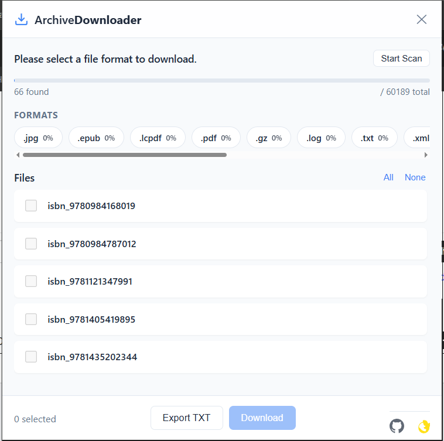
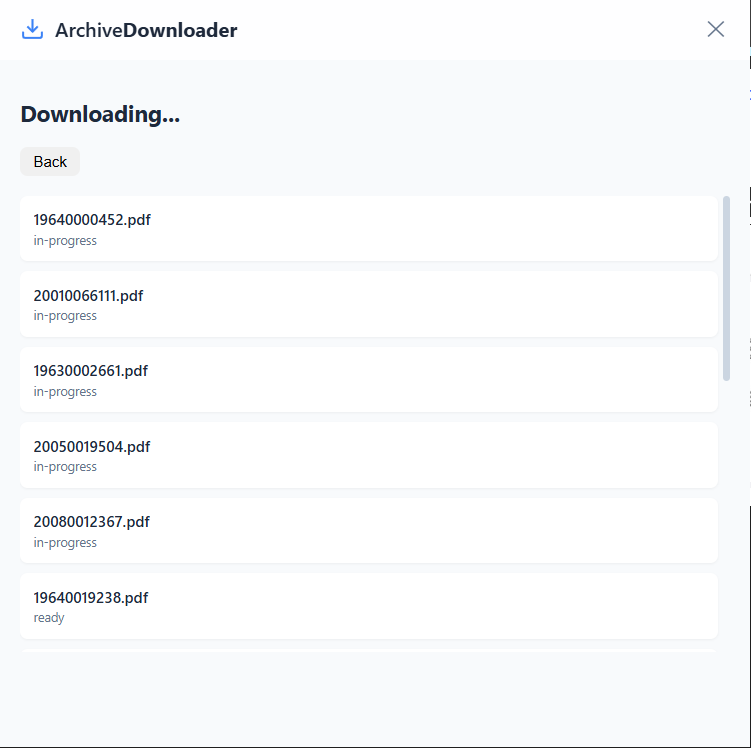

  
# 📚 Archive Downloader Extension

### 🚀 The Ultimate Tool to Download Books, Videos & Collections from Archive.org

 

 

---

**✨ Batch Download • 🔄 Auto-Retry • 📝 Export Errors • 🛡️ Secure & Fast • 🖼️ Custom Branding**

 

---

## 📖 Overview

**Archive Downloader Extension** is a powerful, "Swiss Army Knife" browser extension designed for Archive.org power users. Whether you are downloading a single book, a massive collection of audio files, or historical documents, this extension handles it all with ease, speed, and reliability.

Unlike simple downloaders, this tool is built to handle **bulk operations** and **network instability**, ensuring you get your files even if the connection drops.

---

## 🌟 Key Features

### 🚀 High-Performance Downloading
- **Bulk Batch Downloading:** Select hundreds of files at once. No more clicking "Save As" one by one.
- **Smart Filtering:** Automatically categorizes files by type (PDF, ZIP, JPEG, Audio, Video). Filter exactly what you need.
- **Multi-Threaded:** Downloads multiple files simultaneously to maximize your bandwidth.

### 🛡️ Reliability & Error Handling (New!)
- **🔄 Smart Retry System:** 
  - Did a download fail due to a server hiccup? The extension detects it instantly.
  - A dedicated **"Retry Failed"** button appears, allowing you to re-queue *only* the failed items.
- **📝 Export Failed Links:** 
  - If some files persistently fail (e.g., access denied), you can export the list of failed URLs to a `.txt` file.
  - Use this list with external tools like IDM or JDownloader for advanced handling.

### 🎨 Modern & User-Friendly Interface
- **Clean Dashboard:** A clutter-free popup interface that mimics the look and feel of modern apps.
- **Real-Time Progress:** See exactly how many MBs have been downloaded and the percentage complete for every single file.
- **Visual Feedback:** Color-coded status indicators (Blue: Downloading, Green: Completed, Red: Failed).

---

## 📸 Visual Tour

| **🔍 Advanced Search & Filter** | **⬇️ Batch Download Manager** |
|:---:|:---:|
|  |  |
| *Easily filter item types and select files* | *Track progress, retry failures, and export logs* |

 

---

## 🛠️ Installation Guide

Since this is a powerful developer tool, you can install it in "Developer Mode" on any Chromium-based browser.

1.  **Download the Code:**
    - Clone this repository or download the ZIP file and extract it.
    - `git clone https://github.com/AllLiveSupport/Archive-Downloader-Extension.git`

2.  **Open Extension Management:**
    - **Chrome:** Go to `chrome://extensions`
    - **Edge:** Go to `edge://extensions`
    - **Brave:** Go to `brave://extensions`

3.  **Enable Developer Mode:**
    - Look for the toggle switch (usually in the top-right corner) and turn it **ON**.

4.  **Load the Extension:**
    - Click the **"Load Unpacked"** button.
    - Select the folder wherever you extracted/downloaded this repository (the folder containing `manifest.json`).

5.  **Pin it:**
    - Click the puzzle piece icon in your browser toolbar and pin **Archive Downloader** for easy access.

---

## � How to Use

### 1. Navigate to Archive.org
Go to any "Details" page on Archive.org. For example: `https://archive.org/details/nasa_techdocs`

### 2. Launch the Downloader
Click the orange extension icon in your browser toolbar. The extension will automatically scanning the page for available files.

### 3. Filter & Select
- The extension lists all files associated with the item.
- Use the **Category Tabs** to filter by format (e.g., "PDF only").
- Use the checkboxes to select specific files or click **"Select All"**.

### 4. Start Downloading
Click the large **Download** button at the bottom. The view will switch to the "Downloading..." dashboard.

### 5. Managing Failures (If needed)
If any downloads turn **RED**:
- Click **"Retry Failed"** to try them again automatically.
- Click **"Export Errors (TXT)"** to save the links of the failed files.

---

## ❓ FAQ

<b>Does this work for borrowed books?</b>

This extension is primarily for downloading <b>public domain</b> and open-access files. For borrowed books, you might need specialized scripts depending on the DRM.

<b>Can I download an entire collection?</b>

Yes! If the Archive.org page lists all the files (like in the "Show All" view), this extension can grab them all.

<b>Why do some downloads fail?</b>

Archive.org servers can sometimes be slow or overloaded. Our "Retry" feature is designed specifically to handle these temporary connection drops.

---

## 📜 License

This project is licensed under the **MIT License**. See the [LICENSE](LICENSE) file for more details.

---

### ❤️ Support the Project

If this tool saved you time or helped you archive history, consider supporting!

