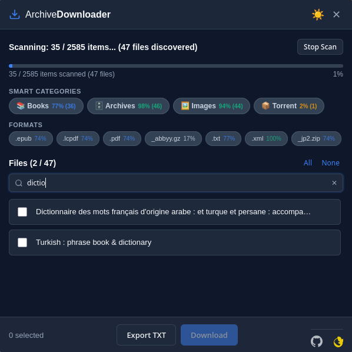
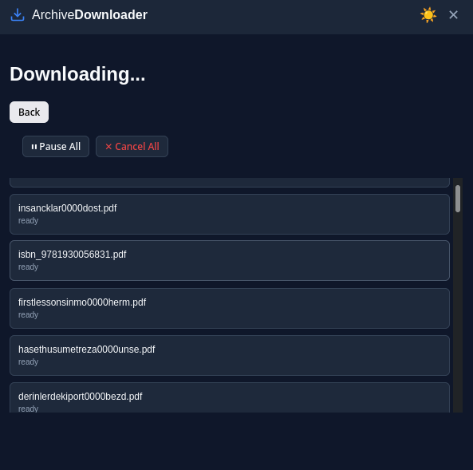

<div align="center">
  
# 📚 Archive Downloader Extension `v1.0.3`

### 🚀 The Ultimate High-Performance Tool to Download Books, Videos, Audio & Collections from Archive.org

<br/>

[](https://github.com/AllLiveSupport/Archive-Downloader-Extension/stargazers)
[](LICENSE)
[](https://addons.mozilla.org)
[](https://buymeacoffee.com/alllivesupport)

<br/>


---

**✨ Universal Solr Facet Engine • 📁 Subfolder Organization • 🔎 Instant Filter • ⚖️ Live Size Calculator • ⏸️ Pause/Resume/Cancel • 🌓 Dark/Light Themes**

</div>

<br/>

---

## 📖 Overview

**Archive Downloader Extension** is a next-generation, powerhouse browser extension specifically engineered for **Archive.org** users, researchers, archivists, and collectors.

Whether you are downloading a single book, a multi-volume box set, a discography album, a video collection, or searching across millions of items with complex sidebar filters, **Archive Downloader** delivers 100% accurate results with unmatched speed, resilience, and convenience.

---

## 🌟 Key Features

### 🎯 Universal Search & Multi-Facet Engine
- **Full Sidebar Facet Support:** Accurately processes complex sidebar combinations (`mediatype`, `creator`, `subject`, `year`, `collection`, `language`).
- **Same-Field OR Grouping:** Combines multi-select items within the same category (e.g. `Texts` + `Movies`) seamlessly without dropping results.
- **Cross-Language ISO Support:** Understands multilingual queries including Turkish, Japanese, Arabic, Russian, and ancient languages.
- **Single Items & Multi-Track Albums:** Automatically binds audio tracks, video derivatives, artwork, and torrents into unified entries or clean individual tracks.

### 🔎 Instant Search & Smart Selection
- **Live Search Filter:** Type any keyword (e.g., `"1996"`, `"Duke Nukem"`, `"Vol.1"`) to instantly filter displayed items in real-time.
- **Filtered Selection:** "Select All" dynamically selects only currently visible filtered items when search is active.
- **Direct Checkbox Selection:** Freely pick any file manually without needing to select a category first!

### ⚖️ Total Download Size Calculator
- **Real-Time Size Calculation:** Instantly calculates the cumulative disk space required for all selected files (e.g. `211 selected • 1.45 GB`).
- **Dynamic Button:** The download button displays the total count and byte size before you click download.

### 📁 Automatic Subfolder Organization
- **Clean File Hierarchy:** Automatically saves downloaded files into dedicated subfolders based on collection names:
  `Downloads/ArchiveDownloader/{Collection_Name}/{File_Name}`
- **OS Path Sanitization:** Eliminates invalid file system characters (`:`, `*`, `?`, `"`, `<`, `>`, `|`) for 100% safe file saving.

### 🛡️ Resilient Download Manager & Controls
- **⏸️ Pause All & ▶️ Resume All:** Pause downloads at any time and resume them effortlessly.
- **✕ Cancel All:** Abort running queues cleanly with a single click.
- **🔄 Smart Retry System:** Re-queue failed or interrupted downloads automatically.
- **📝 Export URLs (TXT):** Export all selected links or only failed links to `.txt` for external download managers (IDM, aria2, JDownloader).
- **🛡️ Rate-Limit (HTTP 429) & Network Backoff:** 4-tier exponential retry handles temporary Archive.org server overload without missing a single item.

### 🎨 Modern UI & Dark Mode
- **Sleek Glassmorphic Design:** Polished interface with crisp typography and intuitive navigation.
- **🌓 Dark / Light Theme Toggle:** Switch effortlessly between light and eye-friendly dark mode. Theme preference is automatically remembered.

---

## 📸 Visual Tour

<div align="center">

| **🔍 Instant Search & Selection Dashboard** | **⬇️ Download Manager & Control Center** |
|:---:|:---:|
|  |  |
| *Smart categories, live search, and total size counter* | *Live progress tracking, pause/resume, retry, and export tools* |

</div>

<br/>

---

## 🛠️ Installation Guide

### 🦊 Firefox (Recommended & AMO Compatible)
1. **Download the Extension:**
   - Clone or download this repository:
   ```bash
   git clone https://github.com/AllLiveSupport/Archive-Downloader-Extension.git
   ```
2. **Open Firefox Debugging:**
   - Open Firefox and go to `about:debugging#/runtime/this-firefox`
3. **Load Temporary Add-on:**
   - Click **"Load Temporary Add-on..."**
   - Select the `manifest.json` file inside the downloaded extension folder.
4. **Pin to Toolbar:**
   - Pin **Archive Downloader** to your toolbar and start archiving!

---

### 🌐 Chrome / Brave / Edge / Opera
1. **Open Extension Settings:**
   - **Chrome:** `chrome://extensions`
   - **Edge:** `edge://extensions`
   - **Brave:** `brave://extensions`
2. **Enable Developer Mode:**
   - Toggle the switch in the top-right corner to **ON**.
3. **Load Unpacked:**
   - Click **"Load unpacked"** and select the extension folder.

---

## 🚀 How to Use

1. **Visit Archive.org:** Navigate to any collection, search page, user profile, or single item page (e.g. `https://archive.org/details/ephemera` or `https://archive.org/search?query=history`).
2. **Open Archive Downloader:** Click the extension icon in your browser toolbar. It will automatically scan and list all available items.
3. **Filter & Select:**
   - Click a **Smart Category** (📚 Books, 🎬 Videos, 🎵 Audio, 📦 Archives, etc.) or specific format (.pdf, .mp4, .zip).
   - Or simply use the search box and manually check the boxes you want!
4. **Download:** Click the **Download** button. Files will be organized into your `ArchiveDownloader/` folder.

---

## ❓ FAQ

<details>
<summary><b>Can I download without choosing a category?</b></summary>
Yes! You can directly check individual boxes for any file you want and hit Download. The extension will automatically pick the best quality format for each item.
</details>

<details>
<summary><b>Where are my files saved?</b></summary>
Files are neatly organized in your browser's default Downloads folder under <code>ArchiveDownloader/{Collection_Name}/</code>.
</details>

<details>
<summary><b>Does this work on large collections with 1000+ items?</b></summary>
Yes! The extension uses high-capacity pagination and rate-limit backoff to scan thousands of items safely.
</details>

---

## ⚠️ Disclaimer

> [!CAUTION]
> **Legal Notice:** This tool is provided for **personal, research, and educational purposes only**.
> - Respect Copyright: Download only public domain or openly licensed content.
> - Comply with Archive.org's Terms of Service.

---

## 📜 License

This project is open-source under the **MIT License**. See the [LICENSE](LICENSE) file for details.

---

<div align="center">

### ❤️ Support the Project

If this tool saved you time or helped you archive history, consider supporting!

[](https://buymeacoffee.com/alllivesupport)
[](https://github.com/AllLiveSupport)

</div>
